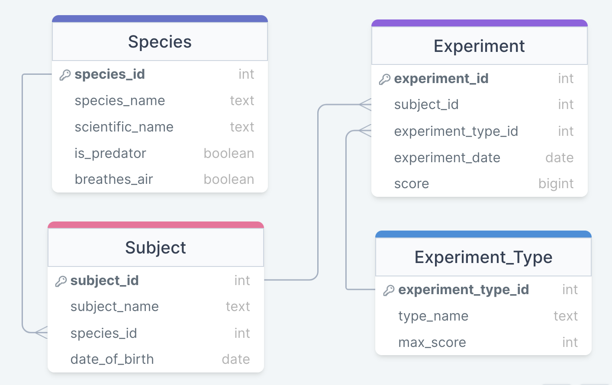

# Marine Experiments API

## Scenario

You've been hired as a contractor by a government agency that must (for security reasons) remain nameless. Their current focus is on training marine animals to complete tasks and (eventually, and potentially) engage in underwater combat. With sea levels rising all over the world, the battles of the future will be fought beneath the waves.

The agency already has a database to store details of their experiments, but it's currently harder to access than they would like. Ideally, there would be an easy-to-use, consistent API that allowed easy communication with the database. Although there has been some work on the API, it is only **half-finished** (the last developer disappeared mysteriously while on a yachting holiday in Slough).

Get set up with the project, and then **work through the tasks** listed below, adding key functionality to the API.

## Setup and installation

1. Navigate to the `marine_experiments` folder
2. Create and activate a new virtual environment
3. Run `pip3 install -r requirements.txt` to install the required libraries
4. Run `psql postgres -c "CREATE DATABASE marine_experiments;"` to create the database.
5. Run `psql marine_experiments -f setup-db.sql` to create and populate the initial database tables

## Development

Run the server with `python3 api.py`; you can access the API on port `8000`.

Reset the database at any time with `psql marine_experiments -f setup-db.sql`.

## Quality assurance

Check the code quality with `pylint *.py`.

Run tests with `pytest -vv`.

## Data model



The `marine_experiments` database has four tables:

- `experiment` for records of individual experiments
- `experiment_type` stores details on the different types of experiment that can be carried out
- `subject` for storing information on individual animals involved in experiments
- `species` which holds details of the different wildlife species involved in the experiments

## ⚠⚠⚠ WARNING: Do not make another connection ⚠⚠⚠

In your `api.py` file you will find this database connection.

> conn = get_db_connection("marine_experiments")

You should **not**

- Make any other connections in your code
- Close that connection

If you do either of these, your tests **will** fail.

If you do not understand this warning, you **must** ask for clarification from a coach

## Tasks

The work required of you has been subdivided into a series of tasks. Completing a task should never undo work on earlier tasks. The earlier tasks are focussed on SQL, and the later tasks are focussed on integrating this into the *partially finished* api.

There is a comprehensive test suite available for all tasks. Use the test suite to guide your code. You will be assessed on both passing tests and code quality, with passing tests being the most important aspect by far.

The test suite relies on a single global database connection (defined in `marine_experiments/api.py`). **Do not create any new connections in your code; always use the global connection. Do not close the global connection.**

The tasks involve both Python and SQL; as much as possible, **data processing should be completed using SQL**.

**For tasks 1-7, you must write your queries in the `marine_experiments/queries` directory.**


### Task 0

> Tools: SELECT, WHERE, LIKE

The, very trustworthy, government agency would like to find all subjects with the letter 'o' in their name (the boss' favourite vowel).

#### Example query response

| subject_id | subject_name | species_id | date_of_birth |
|------------|--------------|------------|---------------|
|          2 | Triton       |          1 | 2022-06-12    |
|          3 | Moana        |          4 | 2018-11-10    |
|          5 | Poseidon     |          4 | 2021-08-08    |

### Task 1

> Tools: JOIN, ORDER BY, TO_CHAR

The government agency would like to see a combined view of information about its (volunteered) subjects. Write a query that will return information about subjects, and the species that they are - specifically including the columns:

- Subject ID
- Subject Name
- Species Name
- Date of Birth

Dates should be expressed in the `YYYY-MM` format.

Objects should be ordered by date of birth in descending order.

#### Example query response

| subject_id | subject_name | species_name | date_of_birth |
|------------|--------------|--------------|---------------|
| 1          | Flounder     | Tuna         | 2023-01       |
| 2          | Triton       | Orca         | 2022-06       |

### Task 2

> Tools: JOIN, WHERE, ROUND, ORDER BY

The government agency (who would like you to know that they have your best interest at heart) want to be able to understand the performance of the animals relative to the maximum scores in the experiments. Write a query that should return a set of rows that give information about subject's performance in each experiment. Each object should contain the following information only:

- Experiment ID
- Subject ID
- Species
- Experiment Date
- Experiment Type Name
- Score

Score should be expressed as a percentage rounded to 2 d.p. (e.g. `"70.34%"`). The percentage score should be calculated based on the maximum score for that type of experiment.

Dates should be expressed as strings in the `YYYY-MM-DD` format.

Experiments should be sorted in descending order by date.

#### Example response

| experiment_id | subject_id | species | experiment_date | experiment_type | score   |
|---------------|------------|---------|-----------------|-----------------|---------|
| 1             | 1          | Tuna    | 2024-01-06      | intelligence    | 23.33%  |
| 2             | 2          | Orca    | 2024-01-06      | intelligence    | 90.00%  |


### Task 3

> Tools: GROUP BY, HAVING, JOIN, ROUND

Write a query that will find the average scores for each experiment type and species displaying the following columns:

- Type name
- Species name
- Average score (round to 1 d.p.)

Only return the experiment types and species that have an average score of higher than 5 and order by average score in descending order.

#### Example output 

  type_name   | species_name | average_score      
--------------|--------------|---------------------
 intelligence | Orca         | 28.0
 intelligence | Tiger shark  | 21.5
 intelligence | Tuna         |  7.0
 obedience    | Tiger shark  |  6.0
 aggression   | Orca         |  5.5


### Task 4

> Tools: CASE, ORDER BY

The completely non-suspicious nameless government agency would like to compare the scores of predators vs non-predators, they have reason to believe that non-predators score up to 20% higher than predators in all the tests. Write a SQL query that will multiply the score of a predator by a factor that increases it by 20% and display the results ordered by the score in descending order.

#### Example output

 species_name | experiment_id | is_predator | score 
--------------|---------------|-------------|-------
 Orca         |             4 | t           |  34.8
 Orca         |             2 | t           |  32.4
 Tiger shark  |             3 | t           |  31.2
 Tiger shark  |             5 | t           |  20.4

### Task 5

> Tools: Insertions

The agency would like to be able to insert a new experiment. Write a query that inserts a new experiment into the database successfully. 

### Task 6

> Tools: Updating

The agency realises that they got their local Tuna's name wrong, instead of Flounder, their name is Derek - the agency understands that if they're going to experiment on Derek, they may as well get their name right. Write a query that updates this.

### Task 7

> Tools: Deletion

The agency would like to remove an experiment from their records (and their memories...), for no shady or suspect reason. Write a query that will remove an experiment with `experiment_id` 1.

### Task 8

> Tools: API

The agency would like to create an API which gives their employees easy access to the experiments via HTTP requests. A `GET` request to the `/experiment` endpoint should accept two optional query parameters. The endpoint will allow the employees to search by experiment type and for experiments that score over a specific value.

- Both parameters accept only specific values; invalid values should result in a `400` response with a JSON response object of the format `{"error": "Invalid value for 'x' parameter"}`.
- If both parameters are passed at once, their effects should combine.
- By default, without the arguments, the endpoint should return a full list of experiments.

#### `type`

This parameter should accept only `"intelligence"`, `"obedience"` or `"aggression"` as values (not case-sensitive). When a valid value is passed to the `type` parameter, only experiments of that type should be returned.

#### `score_over`

This parameter should accept only integer values in the range `0`-`100`. When a valid value is passed to the `score_over` parameter, only experiments where the percentage score was **greater than** the value should be returned.

#### Example response

```python
{
    "experiment_date": "2024-01-06",
    "experiment_id": 2,
    "experiment_type": "intelligence",
    "score":  "90.00",
    "species": "Orca",
    "subject_id": 2
}
```

### Task 9

The agency would like to make deleting experiments more simple, for non nefarious reasons of course! Create a `DELETE` request to the `/experiment/<id>` endpoint should delete the details of a specific experiment.

- If there is no experiment with that ID, the API should return a `404` with a JSON response object of the format `{"error": f"Unable to locate experiment with ID x."}`.
- On successful deletion, the API should return a `200` response and an object containing the deleted item's ID and experiment date.
- Dates should be expressed as strings in the `YYYY-MM-DD` format.


#### Example response

```json
{
  "experiment_id": 3,
  "experiment_date": "2024-01-06"
}
```

### Task 10 [Optional]

A `POST` request to the `/experiment` endpoint should log details of a new experiment.

- The POST body should be sent as JSON
- The POST body _must_ have the following keys:
  - `subject_id` (integer)
  - `experiment_type` (string, case-insensitive)
  - `score` (integer)
- The POST body _can_ have an `experiment_date` key (`YYYY-MM-DD` format string); otherwise, the experiment date should be set to the current day.
- If any of the values in the POST body are invalid (e.g. out of range, wrong type), the response should be a `400` status code and a JSON object of the form `{"error": "Invalid value for 'x' parameter"}`
- A successful request should receive a `201` status code and an object representing the inserted data.

#### Example POST body

```json
{
  "subject_id": 3,
  "experiment_type": "obedience",
  "experiment_date": "2024-03-01",
  "score": 7
}
```

#### Example response

```json
{
  "experiment_id": 11,
  "subject_id": 3,
  "experiment_type_id": 2,
  "experiment_date": "2024-03-01",
  "score": 7
}
```
